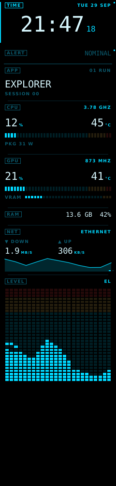
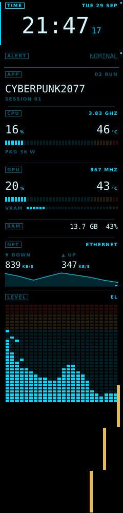
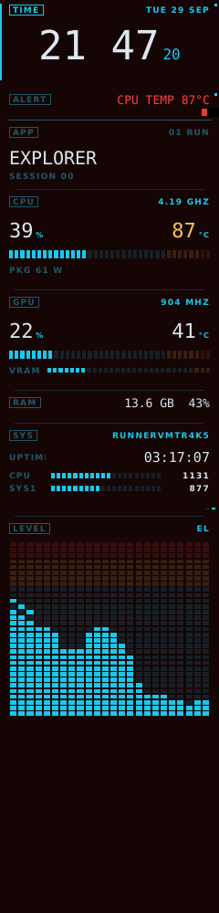
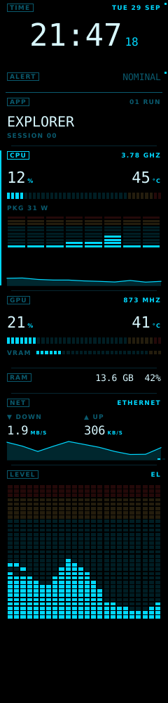
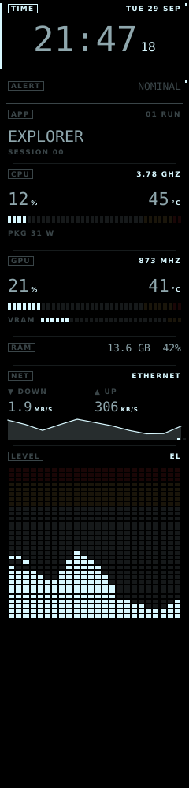

# Core V1-MD

**A Sony MiniDisc-inspired front-panel instrumentation system for a custom gaming / development PC.**

Core V1-MD will turn the front fascia of a **Thermaltake Core V1** Mini-ITX case into a
narrow, always-on AMOLED/OLED instrument strip. It reads like a late-90s Sony MiniDisc deck or
ES-series component: black glass, cyan electroluminescent type, white readouts, amber
warnings, and one precise jog wheel.

> This is **not** a generic sensor monitor and **not** an RGB gaming dashboard.
> It is a premium front-panel instrumentation appliance.

The **Windows host owns the application and UI**. A desktop simulator supports rapid UI
prototyping; the intended hardware boundary is USB to an ESP32-S3 endpoint which drives a
still-unselected OLED/AMOLED panel and reports raw jog-wheel/button events. The simulator
and current hardware-facing code are software prototypes; no physical panel or controller
has been validated.

---

## Contents

- [Project vision](#project-vision)
- [UI proof-of-concepts](#ui-proof-of-concepts)
- [Quick start](#quick-start)
- [Simulator controls](#simulator-controls)
- [Architecture](#architecture)
- [MiniDisc-inspired design language](#minidisc-inspired-design-language)
- [Widgets](#widgets)
- [Theme engine](#theme-engine)
- [Animation engine](#animation-engine)
- [Telemetry framework](#telemetry-framework)
- [Application event framework](#application-event-framework)
- [Planned hardware](#planned-hardware)
- [Future OLED display support](#future-oled-display-support)
- [Future ESP32 integration](#future-esp32-integration)
- [Future jog wheel support](#future-jog-wheel-support)
- [Goals](#goals)
- [Roadmap & milestones](#roadmap--milestones)
- [Development](#development)

---

## Project vision

A deck display does not have *pages*. It has a fixed set of indicators that light up when
they matter. Core V1-MD follows the same idea:

- **One continuous strip of independent widgets** – CPU, GPU, RAM, clock, network, audio
  level, application, system and alerts – stacked vertically.
- **No page navigation.** A physical jog wheel moves focus between widgets; pressing it
  changes how much a widget shows, like the DISPLAY key on a MiniDisc recorder.
- **Application-aware.** Launching a game or an editor triggers a reveal animation chosen
  by data-driven *animation profiles* – never by hard-coded application logic.
- **Quiet by default, loud when it matters.** Amber and red appear only for alerts.
- **Physically invisible to airflow.** The final hardware adds a thin strip to the fascia
  and nothing inside the 200 mm intake path.

## UI proof-of-concepts

Test designs rendered by the simulator itself (240 × 1000, seeded mock data). The full set of
16 scenes and a contact sheet are in [`docs/images/poc/`](docs/images/poc/README.md). To
regenerate them after a design change, run `python -m simulator.pocs`.

<p>
  
  
  
  
  
</p>

## Quick start

Requires **Python 3.12+**. Developed for Windows; also runs on Linux/macOS.

```powershell
cd core-v1-md
python -m venv .venv
.venv\Scripts\activate            # Linux/macOS: source .venv/bin/activate
pip install -r requirements.txt
python -m simulator               # 240 x 1000 resizable simulator window
```

Useful options:

```powershell
python -m simulator --debug                     # start with the debug overlay (F1 toggles)
python -m simulator --theme sony_es_mono        # start with another theme
python -m simulator --width 180 --height 760    # prototype a different panel size
python -m simulator --layout my_layout.json     # custom widget layout
python -m simulator --telemetry system          # live CPU / RAM / network from this PC
python -m simulator --thresholds telemetry/thresholds.json   # custom alert thresholds
python -m simulator --no-persist                # don't load or save layout changes
python -m simulator --state-file my_state.json  # keep layout changes in a specific file

# Headless: render N frames off-screen and save the last one (CI / design reviews)
python -m simulator --headless --frames 180 --launch Cyberpunk2077.exe --screenshot out.png
```

### GitHub Codespaces

The repository includes a dev container (`.devcontainer/`) with Python 3.12, the Qt system
libraries, the requirements, and a lightweight browser desktop for the simulator window.

1. On GitHub: **Code → Codespaces → Create codespace on main** (or on your branch).
2. Wait for setup to finish. It ends with a headless smoke render and a "ready" message.
3. Run the tests in the terminal: `python -m pytest` (the terminal opens in `core-v1-md/`).
4. Open the **Ports** tab, open port **6080** (*Simulator desktop*) in the browser, click
   **Connect** and enter the password `vscode`.
5. In the terminal: `python -m simulator`. The window appears on that desktop. Click it to give
   it keyboard focus for the jog-wheel keys.

In a Codespace, `--telemetry system` reports the cloud VM, not your PC. Use your own
machine for live data.

## Simulator controls

The keyboard and mouse stand in for the physical jog wheel. Everything below is translated
into the same internal `ControlEvent`s that the hardware will produce.

| Input | Control event | Behaviour |
|---|---|---|
| `←` / `↑` / mouse wheel up | `ROTATE_LEFT` | Focus previous widget |
| `→` / `↓` / mouse wheel down | `ROTATE_RIGHT` | Focus next widget |
| `Enter` | `PRESS` | Cycle size: normal → expanded → collapsed |
| `D` | `DOUBLE_PRESS` | Widget action (visualiser mode, 12/24 h clock) |
| `L` | `LONG_PRESS` | Pin / unpin the focused widget |
| `H` / `Home` / `Backspace` | `HOME` | Focus first widget; press again to restore the default layout |
| `Space` / left click | *physical push switch* | Tap = `PRESS`, double-tap = `DOUBLE_PRESS`, hold = `LONG_PRESS` (real gesture timing) |

Layout changes (pin, hide, expand, collapse) are saved as you make them and restored on
the next launch. They go to `%APPDATA%\CoreV1MD\layout_state.json` on Windows and
`~/.config/core-v1-md/layout_state.json` elsewhere. Press HOME twice to go back to the
default layout. Headless runs never touch this file unless `--state-file` is given.

Simulator-only commands:

| Key | Action | Key | Action |
|---|---|---|---|
| `F1` | Debug overlay | `1` | Mock-launch *Cyberpunk2077.exe* |
| `T` | Cycle theme | `2` | Mock-launch *Code.exe* (VS Code) |
| `V` | Next visualiser mode | `3` | Mock-launch *Blender.exe* |
| `Del` | Hide focused widget | `0` | Close foreground app |
| `F12` | Save screenshot to `screenshots/` | `4` | Toggle network link |
| `B` | Replay boot (`SYSTEM_START`) | `5` | Overheat CPU (`HIGH_TEMP`) |
| `S` | Play shutdown (`SYSTEM_SHUTDOWN`) | `6` / `7` | Stall / restore a fan (`LOW_FAN_SPEED`) |
| `Esc` | Quit | | |

## Architecture

```
core-v1-md/
├── README.md
├── requirements.txt
├── pyproject.toml
├── docs/          Architecture, design language, hardware notes, roadmap
├── assets/        Fonts and other static resources
├── themes/        Theme engine + theme JSON files (Sony MiniDisc, Sony ES Mono)
├── widgets/       Independent instruments + EL drawing primitives
├── simulator/     Windows simulator window, keyboard mapping, headless mode
├── telemetry/     Provider interfaces, mock + live system providers, audio sources, hub, thresholds
├── display/       DisplayDevice abstraction, RGB565 prototype, planned frame-region/protocol boundary
├── animations/    Animation engine, animation types, event → animation profiles
├── ui/            Widget manager (focus/pin/rotate), layout, compositor, FrontPanel core
├── core/          Qt-free event bus and control events shared by every layer
├── hardware/      Input devices: jog wheel, push-switch gestures, ESP32 protocol
└── tests/         pytest suite (runs headless with QT_QPA_PLATFORM=offscreen)
```

`core/` and `hardware/` extend the requested layout to keep *events* and *hardware
integration* separate from rendering.

### Data flow

```
TelemetryProvider(s) ─► TelemetryHub ─► TelemetrySnapshot ─► Widgets ─┐
Simulator/OS events ─► EventBus ─► AnimationDirector/Engine ──────────┤
                                                                      ▼
Keyboard / ESP32 raw input ─► host interpretation ─► WidgetManager  Composition ─► Frame
                                                                          │
                                                                          ▼
                                                               Dirty-region detection
                                                                          │
                                                                          ▼
                                                               Encoding / protocol
                                                                          │
                                                                          ▼
                                         Simulator / OffscreenDisplay   USB ─► ESP32-S3 ─► Display
```

### Separation of concerns

| Concern | Package | Knows about |
|---|---|---|
| Telemetry acquisition | `telemetry/` | Sensors / mock data. Nothing about rendering. |
| Widget rendering | `widgets/` | `TelemetrySnapshot`, `Theme`, `QPainter`. Never sensors or hardware. |
| Theme engine | `themes/` | Colours, fonts, metrics, animation defaults. Qt-free. |
| Animation engine | `animations/` | Timing, easing, overlays, profiles. Resolves colours from the active theme. |
| Display abstraction | `display/` | Finished frame/surface and transport boundary. No widget logic. Partial-region protocol is planned. |
| Hardware integration | `hardware/` | Raw inputs → host control events; current ESP32 parser is an ASCII prototype. |
| Composition | `ui/` | Glues the above. `FrontPanel` is the display-agnostic application core. |

The compositor currently renders a complete `QImage` sized to `DisplayDevice.size` and hands
it to `DisplayDevice.present()`. `FutureOledDisplay` converts full frames to RGB565; its
default `NullTransport` records data rather than driving hardware. Dirty-region detection,
binary framing, USB transport, and endpoint firmware are not implemented yet. The simulator
and panel tests validate host software only, not a physical OLED.

See [`docs/ARCHITECTURE.md`](docs/ARCHITECTURE.md) for details and extension guides.

## MiniDisc-inspired design language

Full guide: [`docs/DESIGN_LANGUAGE.md`](docs/DESIGN_LANGUAGE.md).

- **Black is the canvas.** Pure `#000000` – on AMOLED that means pixels are *off*.
- **Cyan is the display, white is the reading.** Labels, frames and meters are cyan; the
  numbers you actually read are soft white.
- **Amber warns, red is critical.** Nothing else uses warm colours.
- **Ghost segments.** Unlit meter segments stay faintly visible, like a real EL/VFD panel.
- **Boxed tags.** Each widget is introduced by a small outlined label (`CPU`, `TIME`,
  `LEVEL`) – the signature MiniDisc indicator style.
- **Tiny letter-spaced labels, big tabular digits.** Information dense, never cluttered.
- **Mechanical motion.** Wipes, scan lines and segment reveals instead of bouncy easing.
- **Title scroll.** Long application names scroll like an MD track title.

## Widgets

| Widget | Kind | Shows |
|---|---|---|
| CPU | `cpu` | Load, package temperature, clock, power; per-core meters and history when expanded |
| GPU | `gpu` | Load, temperature, clock, VRAM; fan/board power and history when expanded |
| RAM | `ram` | Used / total, percentage, history |
| Clock | `clock` | Time with blinking colon, seconds, date; 12/24 h via `DOUBLE_PRESS` |
| Network | `network` | Down/up rate, link state, throughput history, address |
| Audio Visualiser | `audio_visualiser` | Classic Bars, Sony EL Bars, Oscilloscope, Network Activity |
| Application | `application` | Foreground application as a scrolling "track title", running list |
| System | `system` | Hostname, uptime, fans, board temperature |
| Alert | `alert` | Active warnings (amber) and critical alerts (red, blinking) |

Every widget can be **pinned** (fixed region at the top), **rotating** (shares one slot that
auto-cycles with a wipe), **hidden**, **expanded** or **collapsed**. The default layout lives
in [`ui/default_layout.json`](ui/default_layout.json):

```json
{"kind": "network", "rotating": true},
{"kind": "audio_visualiser", "size": "expanded", "mode": "sony_el_bars"}
```

## Theme engine

Themes are JSON files in [`themes/`](themes/) loaded into immutable `Theme` objects and
managed by `ThemeManager`, which supports runtime switching (`T` in the simulator) and
change listeners. Animations resolve their colours from the active theme at paint time.

**Sony MiniDisc** (default):

| Role | Colour |
|---|---|
| Background | `#000000` |
| Primary cyan | `#00D8FF` |
| Secondary white | `#D8F8FF` |
| Alert amber | `#FFD060` |
| Critical red | `#FF4040` |

Adding a theme = dropping a new `*.json` file into `themes/`.

## Animation engine

Reusable, theme-aware reveal primitives (`animations/types.py`):

| Type | Description |
|---|---|
| `horizontal_wipe` | Left → right reveal with a glowing leading edge |
| `vertical_wipe` | Top → bottom reveal |
| `sliding_blocks` | Staggered horizontal shutters slide away |
| `segment_reveal` | Content lights up cell by cell like EL segments |
| `scan_line` | A phosphor scan line sweeps the target (optionally sweep-only) |
| `fade` | Fade from black, or a decaying accent flash |

**Animation profiles** (`animations/profiles/default.json`) map events to sequences of
animations. Application-specific behaviour is pure data:

```json
{"event": "APP_LAUNCHED", "match": {"app": "cyberpunk*"}, "profile": "cinematic_reveal"},
{"event": "APP_LAUNCHED", "match": {"app": "code*"},      "profile": "code_editor"},
{"event": "APP_LAUNCHED",                                  "profile": "app_default"}
```

Rules match on event type plus case-insensitive glob patterns over the event payload; the
first matching rule wins. Steps can target the whole screen or a specific widget by id,
and inherit duration, easing and accent colour from the theme when unspecified.

## Telemetry framework

Widgets never read sensors. `TelemetryProvider.poll()` returns a partial, immutable
`TelemetrySnapshot`; the `TelemetryHub` merges all providers (later ones win), attaches the
latest `AudioFrame`, and derives events. Providers available today:

- `MockTelemetryProvider` – deterministic, smooth random walks with scenario injection
- `SystemTelemetryProvider` – live data via `psutil` (Windows, Linux, macOS): CPU total and
  per-core load, clock, package temperature where the OS exposes it, memory, the busiest
  physical network adapter (throughput, link state, IPv4), uptime and fans where available.
  Enable with `--telemetry system`; pin an adapter with `--adapter "Ethernet"`
- `SectionFilter` – wraps a provider and exposes only chosen sections. In `system` mode the
  mock supplies *only* the application section (so the launch keys still work); the GPU
  shows `--` until a real GPU provider exists
- `MockAudioSource` – synthetic beat/bass/shimmer spectrum and waveform

Alert thresholds (`HIGH_TEMP`, with hysteresis, and `LOW_FAN_SPEED`) come from
`telemetry/thresholds.json` or any file passed with `--thresholds`. Unknown keys,
non-numeric values, and a clear point above the trigger point are all rejected.

Planned providers: **LibreHardwareMonitor** (GPU, fans, power), **HWiNFO** shared memory,
**Windows APIs** (foreground window / process tracking), and **WASAPI loopback** audio. Each
only needs to implement `poll()` (or `AudioSource.read_frame()`).

## Application event framework

`core.events.EventBus` is a small pub/sub bus with a thread-safe queue (`post()` from any
thread, `dispatch_pending()` on the UI thread).

| Event | Produced by |
|---|---|
| `APP_LAUNCHED` / `APP_CLOSED` | Hub – changes to the running application set |
| `SYSTEM_START` / `SYSTEM_SHUTDOWN` | `FrontPanel.start()` / `stop()` |
| `NETWORK_CONNECTED` / `NETWORK_DISCONNECTED` | Hub – link-state edges |
| `HIGH_TEMP` | Hub – CPU/GPU above threshold (with hysteresis) |
| `LOW_FAN_SPEED` | Hub – any fan below minimum RPM |

The `AnimationDirector` turns events into animations; the `AlertWidget` and
`ApplicationWidget` subscribe directly.

## Designed hardware direction

Details and open questions: [`docs/HARDWARE.md`](docs/HARDWARE.md).

- **Case:** Thermaltake Core V1 (Mini-ITX cube, 200 mm front intake fan behind the fascia).
- **Display:** narrow portrait OLED/AMOLED; 240 × 1000 RGB565 is a provisional logical target,
  not a selected physical module.
- **Controller:** ESP32-S3 is the preferred USB-connected hardware endpoint. Development-board
  proof of concept comes before any custom PCB.
- **Input:** a detented rotary encoder with push switch (the jog wheel) plus an optional
  HOME key.
- **Constraint:** nothing in the fan's swept path; power, physical fit, and thermal impact are
  TBD until components are measured.

## Display transport status

`display/oled_display.py` provides a software prototype, not a hardware driver:

- frames are converted to big-endian **RGB565** (`to_rgb565`), the common native format of
  small OLED/AMOLED drivers;
- complete frames go through `FrameTransport` (`NullTransport` today; no real USB/SPI transport);
- optional **burn-in mitigation** via a slow one-pixel orbit;
- brightness control via `set_brightness()`.

Mostly-black styling and pixel shifting may reduce static pixel exposure; they do not
eliminate OLED burn-in. Dirty rectangles are the intended production update strategy; full
frames are for initial synchronization, recovery, and forced refresh.

## ESP32-S3 endpoint status

`hardware/esp32.py` drafts a newline-delimited ASCII protocol over USB CDC serial:

```
ROT <n>        encoder steps since last report
BTN DOWN|UP    push-switch edges (gestures are classified on the host)
HOME           dedicated home key
HELLO <fw>     firmware handshake
```

This is not the planned display protocol and has no USB transport or firmware. The binary
protocol design, capability negotiation, dirty regions, fragmentation, and recovery are
specified in [`docs/DISPLAY_PROTOCOL.md`](docs/DISPLAY_PROTOCOL.md). The host remains
responsible for gesture timing and navigation; the endpoint reports raw hardware events.

## Engineering documentation

- [Engineering assessment](docs/ENGINEERING_ASSESSMENT.md) — repository baseline and risks.
- [Requirements](docs/REQUIREMENTS.md) — uniquely identified functional, quality, and hardware requirements.
- [Display protocol](docs/DISPLAY_PROTOCOL.md) — versioned host/endpoint protocol design.
- [Performance](docs/PERFORMANCE.md) — theoretical bandwidth and measurement plan.
- [PCB architecture](docs/PCB_ARCHITECTURE.md) — future board design gated on a development-board POC.

## Future jog wheel support

The jog wheel is modelled by `hardware.jog.JogWheel` (detent counting, configurable steps
per detent) and `hardware.jog.PressGestureDetector` (PRESS / DOUBLE_PRESS / LONG_PRESS from
raw switch edges). The simulator's `Space` key and mouse already drive these exact classes,
so the feel can be tuned before any hardware exists.

## Goals

- A premium, calm, deck-like instrument – not a dashboard.
- Information dense without clutter; every pixel earns its place.
- Smooth, mechanical, application-aware motion.
- Strict layering: telemetry, widgets, themes, animations, display and hardware evolve
  independently.
- Hardware-agnostic until the hardware is chosen.
- Zero impact on airflow and thermals.

## Roadmap & milestones

Full detail with status, dependencies, risks, tests, and acceptance criteria:
[`docs/ROADMAP.md`](docs/ROADMAP.md).

| Milestone | Title | Status |
|---|---|---|
| **M0–M2** | Audit, requirements, architecture/docs | [~] Documentation baseline in progress |
| **M3–M5** | Display abstraction, protocol, dirty regions | [ ] Planned; current implementation sends full frames only |
| **M6–M9** | ESP32-S3 POC, physical display, input, measurement | [ ] Planned; no physical hardware tested |
| **M10–M12** | PCB, Core V1 integration, long-duration testing | [ ] Planned; PCB gated on POC |

## Development

```powershell
cd core-v1-md
pip install -r requirements.txt
python -m pytest            # headless; QT_QPA_PLATFORM=offscreen is set automatically
```

On minimal Linux containers Qt needs a few system libraries (e.g. `libegl1`,
`libxkbcommon0`, `libfontconfig1`).
