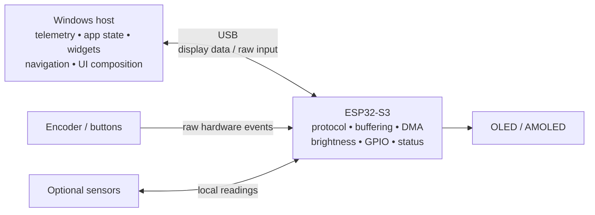
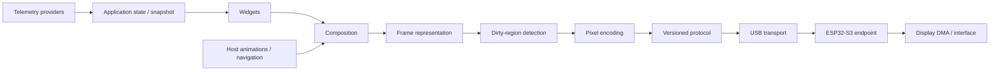
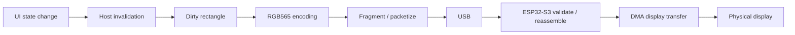
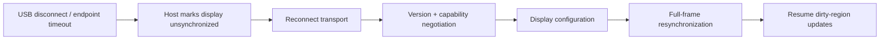

# Architecture

Core V1-MD is layered so that every concern can change independently. The key rule:
**data flows down, events flow sideways, and only the display layer knows where pixels go.**

## Layers

| Layer | Package | Depends on | Qt? |
|---|---|---|---|
| Events & controls | `core/` | – | No |
| Themes | `themes/` | – | No |
| Telemetry | `telemetry/` | `core` | No |
| Hardware input | `hardware/` | `core` | No |
| Widgets | `widgets/` | `core`, `telemetry.models`, `themes` | QtGui (painting) |
| Animations | `animations/` | `core`, `themes` | QtGui (painting) |
| Display | `display/` | frame/device abstractions | QtGui (+ QtWidgets for the simulator) |
| Composition | `ui/` | all of the above | QtGui |
| Simulator | `simulator/` | `ui`, `display`, `telemetry`, `hardware` | QtWidgets |

`core`, `themes`, `telemetry` and `hardware` are Qt-free so they can run in a background
service, on a different process, or be unit-tested in isolation.

## Frame loop (`ui.panel.FrontPanel.step`)

1. **Telemetry** – every `telemetry_interval_s` (default 0.5 s) `TelemetryHub.poll()` merges
   all providers and derives events; otherwise only audio is refreshed (`poll_audio`).
   Widgets receive `update(snapshot, now)` on full polls to accumulate history.
2. **Events** – `EventBus.dispatch_pending()` delivers queued events. The
   `AnimationDirector` resolves profiles and starts animations; widgets such as `AlertWidget`
   update their state.
3. **State** – `WidgetManager.tick()` advances auto-rotation and smooth scrolling;
   `AnimationEngine.tick()` advances animations.
4. **Composition** – `Compositor.render()` computes the layout, paints each widget clipped
   to its rect, draws focus/pin/rotation decorations and separators, paints animation
   overlays, and optionally the debug overlay – all into a `QImage` sized to the display.
5. **Presentation** – `DisplayDevice.present(full_frame)`. `FutureOledDisplay` can compare
   successive images and deliver coalesced RGB565 regions to a region-capable transport;
   USB transport and endpoint negotiation/recovery are not implemented.

Input is asynchronous: an `InputDevice` emits `ControlEvent`s into
`FrontPanel.handle_control()`, which forwards to `WidgetManager.handle()`.

## Target system and software paths

**Designed target:** Windows owns the application. ESP32-S3 is a USB hardware endpoint, not a
second UI computer. The display module, link throughput, and physical integration remain TBD.



The intended host software flow separates responsibilities:



Dirty-region detection is a host software prototype; the following depicts the intended path
from host invalidation through a future USB endpoint:





## Display abstraction

```python
class DisplayDevice(ABC):
    size: QSize                        # logical resolution; compositor renders at exactly this
    def present(self, frame: QImage)   # show a finished frame
    def set_brightness(self, level)    # optional
    def open(self) / close(self)       # optional
```

| Implementation | Status and purpose |
|---|---|
| `SimulatorDisplay` | **IMPLEMENTED** resizable Qt widget; size follows the window |
| `OffscreenDisplay` | **IMPLEMENTED** in-memory fixed size; tests and headless screenshots |
| `FutureOledDisplay` | **PROTOTYPE** RGB565 full-frame/optional region conversion, `FrameTransport`, pixel-shift option; default transport is a recorder, not hardware |

The current region detector compares successive full host images at tile granularity and
coalesces adjacent changed tiles. The packet codec validates individual packets and bounded
fragment sets; `SimulatedFrameTransport` models in-memory delay, refresh limits, loss, reconnect,
brightness, and raw input. No USB transport or endpoint exists. Preserve `DisplayDevice` and
`FrontPanel`: rendering/composition produce a host-owned frame; detection identifies regions;
an encoder emits explicit pixel bytes; a future transport carries versioned messages; and the
endpoint writes pixels to the display. Do not place widget or navigation logic in the display
driver. See
[`DISPLAY_PROTOCOL.md`](DISPLAY_PROTOCOL.md) and [`PERFORMANCE.md`](PERFORMANCE.md).

## Widget model

- `Widget.render()` draws the boxed title tag, header status and delegates to
  `render_body()`; when collapsed it draws a single-line `summary()` instead.
- Widgets receive a `RenderContext` (theme, snapshot, monotonic time, wall time, focus flag)
  and must tolerate any telemetry section being `None`.
- `WidgetState` holds `pinned`, `rotating`, `hidden` and `size`.
- `WidgetManager` turns widgets into *slots*: pinned widgets first, then flow widgets, with
  all rotating widgets sharing one slot. Focus is tracked by slot key so it survives
  re-ordering (e.g. pinning).
- `ui.layout.compute_layout()` stacks pinned widgets in a fixed top region and flows the
  rest in a scroll region that always keeps the focused widget fully visible.

## Extending

### Add a widget

```python
from widgets.base import Widget, WidgetSize
from widgets.registry import register_widget

@register_widget
class StorageWidget(Widget):
    kind = "storage"
    title = "DISK"
    heights = {WidgetSize.COLLAPSED: 30, WidgetSize.NORMAL: 80, WidgetSize.EXPANDED: 140}

    def summary(self, ctx):
        return "--", "dim"

    def render_body(self, painter, rect, ctx):
        ...
```

Then reference `{"kind": "storage"}` in a layout JSON. If the data does not exist yet, add
a field to `telemetry/models.py` (or use `TelemetrySnapshot.extras`) and populate it from a
provider – never from the widget.

### Add a telemetry provider

```python
class LibreHardwareMonitorProvider(TelemetryProvider):
    name = "lhm"
    def start(self): ...                   # connect / spawn sampling thread
    def poll(self, now): return TelemetrySnapshot(timestamp=now, cpu=..., gpu=...)
```

Register it with `TelemetryHub(bus, [MockTelemetryProvider(), LibreHardwareMonitorProvider()])`.
Slow providers should sample on their own thread and return cached data from `poll()`.
`telemetry/system_provider.py` is the reference implementation: it takes the `psutil` module
as a constructor argument, so tests can inject a fake. Wrap a provider in `SectionFilter` to
limit it to specific sections (for example, a mock that only covers the gaps).

### Add an animation type

Subclass `animations.types.Animation`, set `kind`, implement
`draw(painter, rect, theme, p)` where `p` is the eased reveal fraction, and add it to
`ANIMATION_TYPES`. It becomes usable from profile JSON immediately.

### Add an animation profile

Edit `animations/profiles/default.json` (or load another file with `ProfileLibrary.load(path)`):

```json
"profiles": {"doom_intro": [{"type": "sliding_blocks", "duration_ms": 900, "colour": "critical"}]},
"rules":    [{"event": "APP_LAUNCHED", "match": {"app": "doom*"}, "profile": "doom_intro"}]
```

### Add a visualiser mode

Subclass `widgets.audio_visualiser.VisualiserMode` and add it to `VISUALISER_MODES`.

### Add an input device

Subclass `hardware.input.InputDevice`, call `self.emit(ControlEvent.X)`, and connect it with
`device.connect(panel.handle_control)`. Implement `poll(now)` if it needs time-based logic.
