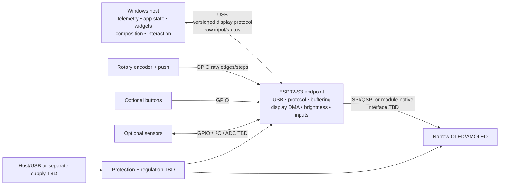
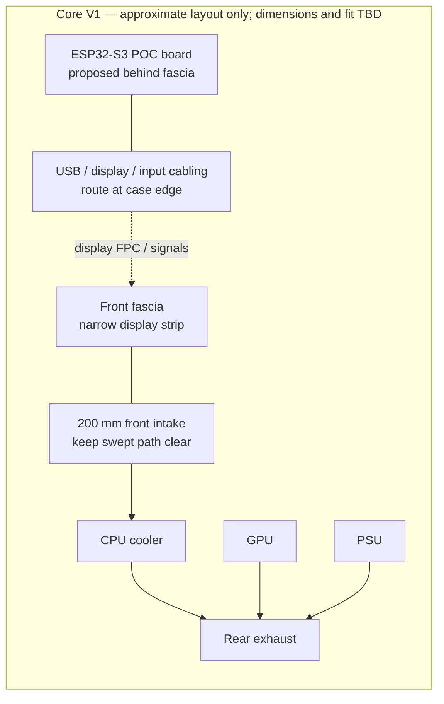

# Hardware architecture and constraints

**Status:** **DESIGNED** architecture; no physical display/controller has been selected or tested. Use an ESP32-S3 development board and suitable display module for the first proof of concept. A custom PCB is a later milestone and is gated on a working, measured POC.

## System topology

The host is authoritative for telemetry, application state, rendering, display layout, animations, navigation, and gesture interpretation. The ESP32-S3 is a hardware endpoint; it does not run a second UI application. It receives full frames for startup/recovery and host-detected dirty rectangles during normal operation, drives the panel, reports raw input/status, and manages hardware recovery.

## Display assumptions

| Property | Current design position |
|---|---|
| Form factor | Narrow portrait strip behind/within the Core V1 front fascia. |
| Logical geometry | 240 × 1000 is provisional for simulator/protocol budgeting, not a selected physical module. |
| Technology | OLED or AMOLED preferred; exact panel **TBD**. |
| Pixel format | RGB565 is the current software prototype. Panel-native format, byte order, and supported alternatives **TBD**. |
| Update policy | Full-frame initial synchronization/recovery; dirty rectangles are the intended production path. |
| Interface | SPI/QSPI or module-native bridge/interface **TBD** after selecting panel. |
| Brightness | Host-controlled brightness is designed; physical control method/range/response **TBD**. |
| OLED care | Mostly-black content, reduced redraw, pixel shifting, dimming, and blanking may reduce exposure; software does not eliminate burn-in. |

At the provisional geometry, a packed RGB565 frame is 480,000 bytes before protocol overhead. See [`PERFORMANCE.md`](PERFORMANCE.md) for theoretical rates and measurement requirements; no link performance has been measured.

## ESP32-S3 endpoint

ESP32-S3 is the preferred controller for the production-class endpoint. Validate a development board first; exact board/module, USB mode, flash, PSRAM capacity/behavior, GPIO availability, and display-interface support remain **TBD**.

Endpoint responsibilities:

- USB connection, version/capability negotiation, packet validation, timeout/reconnect, and status.
- Bounded full-frame/region buffering and fragmentation/reassembly.
- Display-interface transfers using a suitable DMA path where supported.
- Brightness control, raw encoder/button sampling, and optional sensor acquisition.
- Hardware error reporting; no widget, menu, or gesture/navigation policy.

The host protocol design is specified in [`DISPLAY_PROTOCOL.md`](DISPLAY_PROTOCOL.md). `hardware/esp32.py` currently contains only a tested ASCII input parser prototype, not a binary display transport or endpoint implementation.

## USB, memory, DMA, and power

- USB must carry host-to-controller display updates and controller-to-host raw input/status. Nominal USB rates are not application throughput; test the actual board, driver, cable, directionality, reconnect behavior, and workload.
- At least one 480,000-byte RGB565 frame is needed for a full-frame buffer at the provisional geometry. Double buffering requires 960,000 bytes before other firmware allocations. PSRAM is strongly preferred, but verify actual capacity, bandwidth, cache behavior, and DMA accessibility on the selected module.
- DMA can reduce CPU involvement during display writes; it cannot improve USB or panel bandwidth. Determine whether the selected DMA engine can access PSRAM directly or needs a DMA-capable staging buffer.
- Power source, peak/current draw, 3.3 V regulation, panel rail/brightness, USB protection, decoupling, and total power budget are **TBD**. The earlier sub-watt target is not measured or established.
- Record endpoint and display current/temperature under boot, static idle, high brightness, animation, full-frame sync, and reconnect before defining acceptable limits.

## Inputs and future sensor expansion

- Rotary encoder: GPIO inputs for quadrature A/B; endpoint reports raw signed steps/direction.
- Encoder push and optional home/auxiliary buttons: endpoint reports press/release edges. Host performs debounce/gesture interpretation where appropriate and owns navigation.
- Optional sensors: reserve suitable GPIO/I²C/ADC resources only after use cases are identified; no sensor is required for the initial display POC.
- Pin assignments, voltage levels, pull-ups, debounce, connector, cable length, and ESD protection are **TBD**.

### Planned PC control is not endpoint power control

Fan-speed and voltage/clock adjustment requirements in [`REQUIREMENTS.md`](REQUIREMENTS.md)
refer to authorized **host PC backends**, not GPIO/ADC outputs or the display's power rails.
No fan controller wiring, motherboard voltage-write interface, or tuning backend is selected.
The device settings view is rendered by the host and cannot independently authorize writes.
Unknown component limits, missing fresh health data, or unverified recovery support keep
advanced tuning locked. Validate fan minimum duty, cooling capacity, thermal/power/current
limits and recovery on the actual PC before enabling any supported write feature.

## Core V1 physical constraints

The Thermaltake Core V1 front fascia is in front of a 200 mm intake fan. The display, controller, connector, and cables must not enter the fan's swept path. Existing dimensions and clearances have not been measured for this project.

This is a conceptual placement diagram, not a measured case drawing: board location, display
mount, cable path, CPU-cooler orientation, GPU/PSU arrangement, and exhaust routing must be
confirmed against the actual Core V1 build. Keep all added components and cabling out of the
fan's swept area and verify airflow in the assembled case.

Before final mechanical design:

1. Measure fascia depth/curvature, visible opening, available board volume, connector clearance, cable bend radius, mounting points, and service access.
2. Place the development board/module and display mock-up without covering the intake or obstructing the fan.
3. Compare airflow/temperature with and without the assembly under repeatable load; assess local controller/display heat separately.
4. Verify display readability/viewing angle, cable retention, power routing, noise, and safe removal.

Do not claim zero or negligible thermal impact until measurements support it.

## Development and custom PCB gate

1. Select a suitable ESP32-S3 development board and display module for a POC; confirm USB and panel interface details from their documentation.
2. Validate protocol negotiation, full-frame synchronization, dirty-region updates, brightness, raw input, transport faults/reconnect, and memory headroom.
3. Measure transfer/visible latency, throughput, update rates, CPU, memory, current, and thermal behavior.
4. Only after POC review, develop the eventual board described in [`PCB_ARCHITECTURE.md`](PCB_ARCHITECTURE.md).
5. Validate custom-board bring-up, case fit, airflow, serviceability, and long-duration behavior independently.

**No physical hardware is currently tested.** Simulator screenshots, RGB565 conversion tests, and fake transports are software evidence only.
