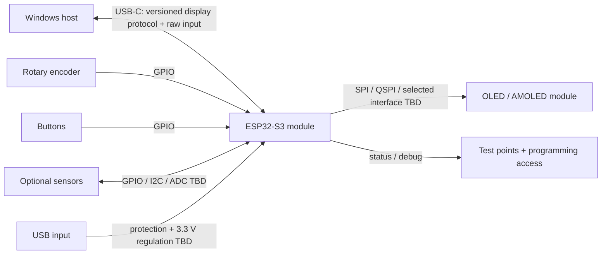

# Custom PCB architecture (future)

**Status: PLANNED / DESIGN ONLY.** No schematic, PCB layout, selected components, or custom board exists. First validate the complete display/protocol/input proof of concept on an ESP32-S3 development board and suitable display module. Do not start final custom PCB design before that gate passes.

## Intended boundary

The PCB is a hardware endpoint, not an independent UI computer. Windows remains authoritative for telemetry, application state, widgets, composition, animations, and navigation. The ESP32-S3 endpoint receives negotiated full-frame/dirty-region pixel updates over USB, drives the panel, controls brightness, and reports raw input and hardware status.

## Functional blocks

| Block | Architectural intent | Selection / validation |
|---|---|---|
| ESP32-S3 module | USB-capable endpoint, display transfer control, raw input, health/status. Prefer a module appropriate for development and later service. | **TBD:** exact module, USB mode, available GPIO, thermal limits, certification, module memory configuration. |
| PSRAM | Preferred capacity for display/frame or region buffering; firmware must validate which memory is accessible to DMA and reserve enough internal RAM for runtime needs. | **TBD:** capacity, bus bandwidth, DMA/cache constraints on chosen module. |
| Flash | Holds endpoint firmware, protocol metadata, and recovery/update support. | **TBD:** size and partition/update strategy after firmware design. |
| USB-C | Host connection for bidirectional display protocol, input/status, power (if appropriate for final power budget). | **TBD:** data mode, connector/cable, USB protection, power-source and negotiation decisions. |
| USB protection | ESD/transient protection appropriate to connector exposure and signal integrity. | **TBD:** protection components and layout review based on actual link. |
| 3.3 V regulation | Powers ESP32-S3 and suitable logic; account for Wi-Fi/transient current if radio is ever enabled, display interface, and thermal dissipation. | **TBD:** upstream supply, current budget, regulator, sequencing, decoupling. Do not infer the display's power rail from this logic rail. |
| Display connector | FPC or module connector appropriate to the actual panel interface, pin count, pitch, retention, and cable bend. | **TBD:** panel/module first; connector and pinout must follow manufacturer documentation. |
| Encoder connector | GPIO for quadrature A/B and push-switch input with appropriate filtering/debounce strategy. | **TBD:** connector, pull-ups, pin allocation, cable length, ESD. |
| Buttons | Optional home/auxiliary button inputs; raw edges go to host through protocol. | **TBD:** count, connector, pull configuration. |
| Optional sensors | Reserved GPIO/I²C/ADC capability for explicitly selected future sensors; no speculative sensor subsystem required for first POC. | **TBD:** sensor type, bus, location, calibration, thermal environment. |
| Test points | Expose critical rails, ground, reset/boot, USB/serial debug as appropriate, display control signals, and selected GPIO for bring-up. | **TBD:** final test fixture and accessibility. |
| Status LED | Low-power indication for power, firmware/USB state, or errors; avoid distracting front-panel light leakage. | **TBD:** location, brightness, disable option. |
| Programming/debug | Provide reliable ESP32-S3 programming, recovery, and serial/log access, even if USB is the normal runtime connection. | **TBD:** connector/headers and production access. |
| Mounting | Board outline, mounting holes, component height, cable exits, and strain relief suited to the Core V1 fascia volume. | **TBD:** measure case and display clearances; keep outside fan swept/intake path. |

## Design constraints and open decisions

- The exact display, resolution, controller/interface, FPC pinout, RGB565 byte order, and brightness semantics must be selected and verified before schematic work.
- Confirm USB endpoint capability and sustained application payload on the exact development board. Do not design around nominal USB line rate alone.
- Confirm PSRAM size and whether selected display DMA can access it directly; otherwise establish an explicit DMA-capable staging strategy.
- Establish peak/average current for controller, panel, backlight/brightness control if applicable, and optional sensors. The existing sub-watt target is not verified.
- Keep cables, board, and display outside the fan's swept path; measure fascia depth, intake obstruction, visibility, service access, and thermal effects.
- Provide safe behavior on USB reset, panel reset, incomplete frame, and loss of host connection. The host resynchronizes the display after reconnection.
- PCB manufacturing, antenna/RF, compliance, ESD, creepage, power protection, and connector retention require review against the final product configuration.

## Development and release gates

1. **Development-board POC:** establish host negotiation, full frame, dirty update, brightness, encoder/button reporting, and reconnect with the chosen display module.
2. **Measure:** USB/display bandwidth, visible latency, memory use, CPU load, power, temperatures, and update reliability under static, animated, and recovery loads.
3. **Architecture review:** resolve component, connector, pin, power, mounting, thermal, and service decisions; document measured interface requirements.
4. **Custom PCB:** only then create schematic/layout, review design rules and protection, fabricate a prototype, and repeat the bring-up/measurement plan.
5. **Core V1 integration:** validate mounting, cable routing, airflow, temperatures, visibility, and 24/72-hour operation. Simulation or development-board results alone do not satisfy this gate.
