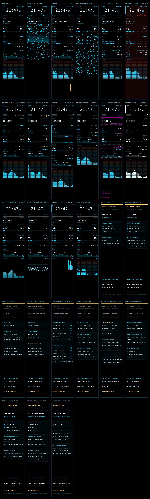

# UI proof-of-concept renders

**RENDER** scenes use the real simulator pipeline (`FrontPanel` → `OffscreenDisplay`),
with seeded mock telemetry and a fixed clock, not a live hardware connection.
**DESIGN** scenes are standalone static QImages labelled **DESIGNED / MOCK** inside each image.
They bypass FrontPanel and are proposed interaction contracts, not working controls.
All images are 240 × 1000. Regenerate after any design change:

```bash
cd core-v1-md
python -m simulator.pocs
```

Scenes are defined in `simulator/pocs.py`. Because rendering is deterministic, a git diff
of this folder shows exactly which screens a change affected.
Fan RPM bars are relative display meters, not validated control limits. Overflow fans are
summarised as `+N` / `+N MORE FANS`; every visible fan has an icon, name and RPM units.
Concept fan edits never send a command; confirm is unavailable. Settings do not persist
or synchronize. Separate app and device panels show identical keys; fan/media/tuning
write switches default OFF, while paging/jogging default ON (design only).
Explicit CANCEL/back/long press discards unsubmitted drafts, with no success or applied
readback claim. Unsupported/stale indications, view paging and media navigation are
designed only. Shared editing contract: first click SELECT → turn STAGE → second click
CONFIRM (gated). The confirmation-gate preview is not a third mandatory review click.
Fan duty draft numbers are illustrative only, not safe limits; backend bounds remain TBD.
Music gestures have no media backend. Voltage stays **LOCKED** until
per-device bounds/capability and a write backend are validated; no safe voltage numbers
are asserted. There is no implemented unlock, tuning, or rollback path in these previews.



| Scene | Type | Shows |
|---|---|---|
| [Idle](01-idle.png) | FrontPanel render | Default layout at rest: pinned clock and alert, instruments, Sony EL bar visualiser. |
| [Boot reveal](02-boot.png) | FrontPanel render | SYSTEM_START: segment reveal with a scan-line sweep. |
| [App launch · Cyberpunk](03-launch-cyberpunk.png) | FrontPanel render | APP_LAUNCHED cyberpunk* → cinematic_reveal profile (amber sliding blocks). |
| [App launch · VS Code](04-launch-vscode.png) | FrontPanel render | APP_LAUNCHED code* → code_editor profile (stepped segment reveal). |
| [Gaming load](05-gaming-load.png) | FrontPanel render | Cyberpunk running: GPU and CPU under load after the reveal has settled. |
| [Critical · high temperature](06-high-temp.png) | FrontPanel render | HIGH_TEMP → critical profile: red flash over the strip, alert widget in red. |
| [Network disconnected](07-network-down.png) | FrontPanel render | NETWORK_DISCONNECTED: link state and zero throughput. |
| [Warning · fan stalled](08-fan-stall.png) | FrontPanel render | LOW_FAN_SPEED → warning profile: amber blocks on the alert widget. |
| [Focus · CPU expanded](09-cpu-expanded.png) | FrontPanel render | Jog: rotate to CPU, PRESS to expand (per-core bars). |
| [Dense · collapsed](10-collapsed.png) | FrontPanel render | Instruments collapsed to single lines for maximum density. |
| [Debug overlay](11-debug-overlay.png) | FrontPanel render | F1: widget bounds, fps, last control and event. |
| [Theme · Sony ES Mono](12-theme-es-mono.png) | FrontPanel render | Alternative theme, same widgets. |
| [Visualiser · Classic bars](13-vis-classic-bars.png) | FrontPanel render | Classic spectrum bars. |
| [Visualiser · Oscilloscope](14-vis-oscilloscope.png) | FrontPanel render | Waveform trace. |
| [Visualiser · Network activity](15-vis-network.png) | FrontPanel render | Throughput history in the visualiser slot. |
| [Shutdown](16-shutdown.png) | FrontPanel render | SYSTEM_SHUTDOWN: reverse vertical wipe. |
| [Fan · focus](17-designed-fan-focus.png) | DESIGNED / MOCK | DESIGNED/MOCK: focus SYS fan group; mock named RPM readings. No fan write capability. |
| [Fan · select](18-designed-fan-select.png) | DESIGNED / MOCK | DESIGNED/MOCK: jog chooses one named fan, PRESS proposes editing; missing readings remain -- RPM. |
| [Fan · edit](19-designed-fan-edit.png) | DESIGNED / MOCK | DESIGNED/MOCK: turn stages an illustrative CPU duty draft from 50 % to 55 %, not a safe range or applied setting. Second click confirms (gated); chosen backend bounds TBD, so confirmation unavailable. Jog changes draft only; no control backend. |
| [Fan · confirm](20-designed-fan-confirm.png) | DESIGNED / MOCK | DESIGNED/MOCK: confirmation-gate visual state for the second click, not an extra mandatory review click. Illustrative 50 % to 55 % duty draft is not a safe range; confirm unavailable pending validated bounds/capability/backend. Cancel discards draft; no write or success claim. |
| [Shared settings](21-designed-settings.png) | DESIGNED / MOCK | DESIGNED/MOCK: separate COMPANION APP and DEVICE JOG panels share the same settings keys and draft model. VIEW PAGING and ELEMENT JOG default ON; FAN CONTROL, MEDIA CONTROL and ADV TUNING default OFF. Capability gates require validation, regardless of switch state. Static surfaces only; back/long press discards unsubmitted edits; no persistence/synchronization. |
| [Music · jog](22-designed-music-jog.png) | DESIGNED / MOCK | DESIGNED/MOCK: first click selects the music volume element, turn stages a draft, second click confirms (gated), without a third review click. Confirm remains disabled with media writes OFF/no backend. Double press never fires media during edit; back/hold discards the unsubmitted draft. No playback, success or readback. |
| [Voltage · LOCKED](23-designed-voltage-locked.png) | DESIGNED / MOCK | DESIGNED/MOCK: voltage tuning LOCKED. No numeric voltage or safe range asserted; no editing, confirm, or write until per-device limits and a backend are validated. |
| [Fan · CANCEL](24-designed-fan-cancel.png) | DESIGNED / MOCK | DESIGNED/MOCK: explicit CANCEL/back/long-press transition discards an unsubmitted fan draft and returns to fan selection. No command, success acknowledgement or applied-value readback. |
| [View · paging](25-designed-view-paging.png) | DESIGNED / MOCK | DESIGNED/MOCK: jog pages instrument views rather than changing a value; visible page count and omitted fan count. Paging/jogging ON by default; no writes, layout persistence or runtime paging added. |
| [Media · navigate](26-designed-media-navigation.png) | DESIGNED / MOCK | DESIGNED/MOCK: first click selects the music transport element, turn in the action chooser stages previous/next track or play/pause, second click confirms (gated), without a third review click. Confirm is disabled with media writes OFF/no backend. No double-press shortcut during edit; back/hold cancels without playback, success or readback. |
| [Fan · read only](27-designed-fan-read-only.png) | DESIGNED / MOCK | DESIGNED/MOCK: selected REAR fan has unavailable RPM, UNSUPPORTED capability and STALE telemetry. The fan preview visibly disables EDIT/CONFIRM; fan writes OFF. Inspection/back only, with no backend action or applied-value claim. These availability states are designed, not runtime detection. |
