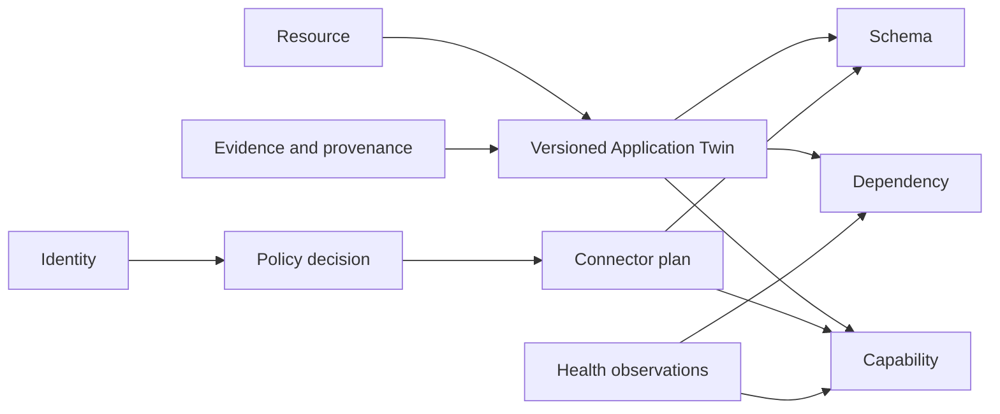
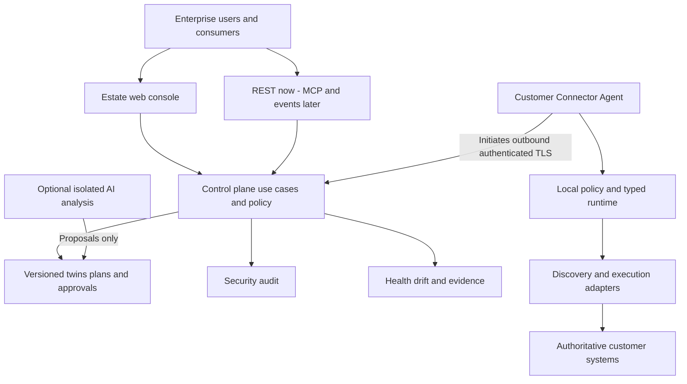

# Architecture — proposed, not implemented

## Repository assessment

The repository currently implements **Core V1-MD**, a Python 3.12+/PySide6 front-panel
instrumentation simulator for a Thermaltake PC. It is not an enterprise integration backend.

| Existing area | Evidence | Implication for this proposal |
|---|---|---|
| Python/Qt desktop product | `core-v1-md/README.md`, `core-v1-md/pyproject.toml` | Preserve runtime and packaging; no assumed .NET/React server |
| Event, widget, telemetry and display boundaries | `core-v1-md/docs/ARCHITECTURE.md`, `core-v1-md/widgets/base.py` | Useful separation principles, not an Application Twin implementation |
| Host snapshots | `core-v1-md/telemetry/models.py` | PC telemetry is not enterprise identity, provenance or capability health |
| Hardware prototypes | `core-v1-md/display/`, `core-v1-md/hardware/` | Display transport is not an enterprise Connector Agent |
| Existing tests and CI | `core-v1-md/tests/`, `.github/workflows/ci.yml` | Preserve pytest, Ruff and headless rendering on Windows/Linux |
| Product-specific docs/gallery | `core-v1-md/docs/`, `core-v1-md/docs/images/poc/` | Do not rename or replace the hardware roadmap or renders |

Inspection of source/configuration found no existing Application Twin, enterprise
control plane, discovery adapters, REST/OpenAPI/MCP server or enterprise identity service.
This is a source inspection, not an executed runtime or production security assessment.
No existing callers, interfaces, dependencies, tests or schemas are changed by this PR.

## Proposed repository structure

Only root documentation and the README link are introduced now. Future implementation
locations below are **proposals**, not scaffolding or approved migrations.

```text
README.md                         existing product + separate design entry
core-v1-md/                       existing runtime, docs and tests; unchanged
docs/                             new product design documents
  adr/                            proposed decisions
  diagrams/                       Mermaid source
fabric/                           future, only after S0 approval
  src/
    domain/                       protocol/infrastructure-independent models
    application/                  use cases, policy and adapter ports
    control-plane/                registry, approvals, job coordination
    agent/                        local trust, discovery and deterministic runtime
    adapters/                     Excel first; independent source integrations
    interfaces/                   REST/OpenAPI, later MCP/events
    infrastructure/               persistence, identity, secrets, messaging
    web/                          estate console
  tests/
    domain/
    contracts/
    integration/
    security/
    end-to-end/
  deployment/                     reviewed packaging and infrastructure
```

Human approval decides whether `fabric/` belongs here or in a separate product repository.
Do not move existing code, change its public contracts or add new runtime dependencies
as part of this design. No code reuse is assumed merely because both products have telemetry.

## Domain model and ownership

| Concept | Responsibility / invariants |
|---|---|
| Resource | Tenant-scoped registered source identity, owner, locator reference, classification and permitted boundaries |
| Application Twin | Versioned observed/proposed context for one Resource; may relate multiple child resources; unknown is explicit |
| Capability | Narrow business operation with versioned input/output schema, effects, source dependencies and lifecycle |
| Data Model / Schema | Versioned canonical and source structures, compatibility and validation rules |
| Dependency | Typed, directional, evidence-backed resource/capability relationship; required/optional and health impact |
| Connector | Versioned deterministic execution plan joining approved capabilities/resources with reviewed mappings |
| Policy | Versioned allow/deny rules, constraints and decisions; default deny, explicit deny wins |
| Identity | External issuer/subject/tenant, groups and service identities; agent identity is distinct from user identity |
| Observability | Time-stamped measurements, health assessments, thresholds and impact, separate from audit |
| Evidence / Provenance | Permission-protected source references and transformation lineage supporting facts and results |

Every persisted identifier/reference includes tenant scope. Cross-tenant graph edges
are invalid. Secrets are references to secret stores, never twin or connector fields.
Approvals bind exact twin/schema/plan/policy versions and expire or invalidate on material
change. The tenant control plane owns registry and approval state; the customer source
owns data/ACLs; the local agent owns enforcement at execution.



## Components and data flows

The web/API layer calls application use cases; domain logic has no filesystem, SQL,
identity-provider, UI or protocol dependencies. Infrastructure implements ports for
registry storage, secret resolution, policy evaluation, adapters, audit and transport.
Composition roots wire dependencies; external services are mockable.

1. An authorised owner registers an agent-scoped locator. The agent verifies the local
   root and source permissions before inspecting it.
2. Read-only discovery returns bounded evidence/metadata; the control plane versions
   a partial twin. Optional AI proposes assertions, never executable authority.
3. Reviewers approve specific capabilities and mappings. Compilation permits only a
   finite set of typed adapter operations; no uploaded scripts or expression `eval`.
4. An authenticated request is tenant-bound, schema-validated and authorised. The
   control plane dispatches a short-lived, integrity-protected job over an agent-initiated
   outbound connection.
5. The agent verifies assignment, versions, expiry, replay/idempotency, local policy and
   effective source permissions, then executes an approved deterministic plan.
6. Results are schema-validated and minimised; permitted field lineage, telemetry and
   security audit are recorded. Health and drift can suspend affected interfaces.



## Technology and scaling decisions

.NET for enterprise services/Windows agent, React/TypeScript for the console, PostgreSQL
for metadata, and standard REST/OpenAPI are candidates, not selected dependencies.
Evaluate OS/source integration, supported Excel automation, deployment, identity,
tenant isolation, skills and operating costs before selection in S0/S1.

Start with logical modules and a small deployable control plane, not speculative
microservices. Use relational metadata plus typed graph edges initially if approved;
a graph database is not required by the domain. Keep large protected evidence in a
separate encrypted store when needed. Payloads remain local unless policy permits egress.
Transport technology and hosting remain open; outbound work delivery must support
bounded queues, backpressure, correlation and cancellation without becoming a new protocol.

Revocation is enforced centrally and locally through short-lived work authorisations.
Disconnected agents cannot start new remote jobs after authorisation/policy expiry.
Long-running work is cancelled at safe checkpoints where possible; unknown side effects
require reconciliation. Maximum revocation lag needs security approval.

## Design documentation

- [Vision](vision.md), [product definition](product-definition.md), [requirements](requirements.md)
- [Security](security.md), [identity and access](identity-and-access.md), [threat model](threat-model.md)
- [Application Twin](application-twin.md), [discovery](discovery.md), [capabilities](capabilities.md)
- [Connectors](connector-model.md), [API model](api-model.md), [MCP](mcp.md)
- [Observability](observability.md), [provenance](provenance.md), [contract drift](contract-drift.md)
- [UX](ux.md), [testing strategy](testing-strategy.md), [deployment](deployment.md), [roadmap/issues](roadmap.md)
- Proposed ADRs: [agent trust](adr/ADR-001-agent-trust-boundary.md),
  [AI boundary](adr/ADR-002-ai-not-runtime.md), [standard protocols](adr/ADR-003-standard-protocols.md),
  [twin](adr/ADR-004-application-twin.md), [identity](adr/ADR-005-identity-and-authorisation.md),
  [MCP interface](adr/ADR-006-mcp-as-interface.md)
- Mermaid sources: [context](diagrams/system-context.mmd), [deployment](diagrams/deployment.mmd),
  [security](diagrams/security-boundary.mmd), [twin](diagrams/application-twin.mmd),
  [discovery](diagrams/discovery-flow.mmd), [connector lifecycle](diagrams/connector-lifecycle.mmd),
  [observability](diagrams/observability.mmd), [identity](diagrams/identity-flow.mmd),
  [claims example](diagrams/claims-example.mmd)

All ADRs are proposed; approval of this document does not by itself authorise production
execution, data egress, a technology choice, or a product/repository migration.
