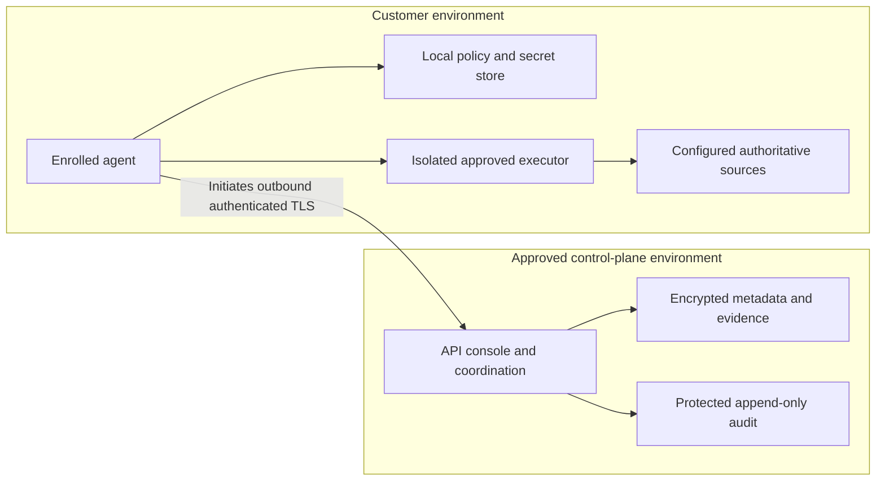

# Deployment — proposed

## Topology and ownership

Tenant control plane: identity-integrated API/console, registry/approval/policy modules,
work coordination, encrypted metadata/evidence stores and separately controlled audit.
Customer environment: enrolled least-privilege agent, local policy/secret protection,
bounded discovery workers and isolated deterministic execution workers accessing
only configured sources/targets.

The agent initiates an outbound authenticated TLS channel to a configured control-plane
endpoint. The channel delivers only tenant/agent-bound approved work; it is not a remote
desktop or shell. Agent-to-target traffic also follows local egress policy. Customer
proxy/firewall, residency and managed/on-premises control-plane choices need approval.

## Excel/VBA execution gate

Static workbook/VBA discovery comes first and never runs macros. Demonstrating the
complete MVP additionally requires one approved deterministic calculation capability.
Do not assume unattended Office automation is supported, licensed, reliable or safe.

S0/S3 must establish the pilot's exact workbook/procedure, accessible VBA, operating
system, Excel/COM or other supported execution method, licensing, interactive/session
requirements, isolation, side effects, dependent files/network access, concurrency,
recovery and source/target permissions. Obtain source-owner, operations and security
approval before enabling execution.

If supported invocation cannot be established, the milestone is **blocked** and a
revised MVP decision is required. Static discovery is useful but is not mislabelled a
complete execution slice. No arbitrary macro selection, machine-admin requirement,
unsupported Windows service workaround or invented cross-platform VBA executor.

## Lifecycle and operations

Secure enrollment binds tenant/agent identity and locally configured roots. Use
one-time enrollment material, authenticated recovery and standard certificate rotation.
Stage signed package/configuration updates, verify publisher/version/digest, canary,
health-check and explicitly authorised rollback. Avoid downgrading security controls.

Keep tenant-bound bounded encrypted queues/spools, with policy/authorisation expiry.
No new work when offline authorisation expires; full audit storage fails closed.
Restart recovery reconciles pending side effects and deduplication before accepting replay.

Backup and restore versioned registry/approval metadata, keys and authorised audit/evidence
under reviewed retention/residency policy. Restore must not revive revoked capability
versions, expired entitlements or old certificates. Test disaster recovery and incident
containment; RPO/RTO and operational ownership remain approval decisions.

Do not add deployment infrastructure in this PR. The existing dev container and CI
belong to Core V1-MD, not a ready-to-run enterprise fabric.
