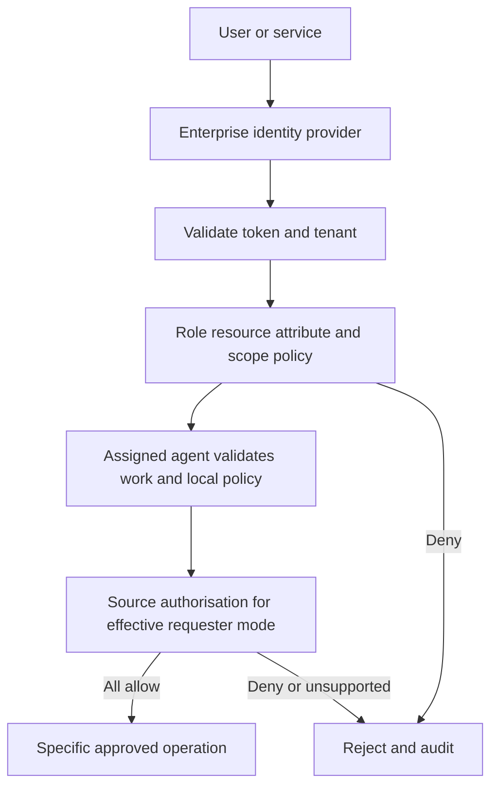

# Identity and authorisation — proposed

## Identities

Use enterprise OpenID Connect providers (including Microsoft Entra ID where selected).
Active Directory source permissions may require Windows domain integration and constrained
delegation; AD itself is not assumed to be an OIDC issuer. Federation/protocol choices
need identity-team approval. The platform never replaces directory/identity management.

Represent tenant, validated issuer and immutable subject; external groups map to
versioned platform role bindings. Keep user, consuming service, control-plane service,
agent workload and source execution identity distinct. Do not authorise by email or
trust caller-supplied group/tenant claims without token verification.

| Role candidate | Allowed responsibility | Not automatically allowed |
|---|---|---|
| Resource owner | Register/review own resources and semantics | Grant source ACLs or approve every deployment |
| Integration operator | Prepare/deploy approved connectors | Approve own sensitive plan or bypass policy |
| Security approver | Approve access/egress and policy constraints | Read arbitrary business payloads |
| Consumer | Use explicitly granted capability/version/scopes | List all resources, change plans or execute macros |
| Auditor | Inspect authorised audit/evidence | Invoke capabilities or mutate audit |

Role separation and approval quorum are proposals. Require independent approval for
sensitive execution/access changes; the pilot's exact matrix is a human decision.

## Decision path

1. Validate signature, issuer, audience, lifetime and configured tenant against trusted
   provider metadata; browser sessions use safe OIDC flows, CSRF protection and secure cookies.
2. Resolve current role/group bindings and attributes, resource classification, capability
   version, operation/effects, approved plan, policy revision and context.
3. Apply RBAC plus resource/attribute constraints; explicit deny wins. Scopes alone do
   not grant resource access. Filter list/search/graph/health results as well as direct reads.
4. Verify the execution identity mode and source entitlement. The local agent checks
   fresh policy plus actual source permissions again immediately before access.
5. Record decision/reason and effective identity; return a non-sensitive denial.

Revoked membership, expired approval or changed source ACL denies new work. Cache
lifetimes are bounded by the approved revocation window; unavailable verification
fails closed. Object identity guesses must not reveal unauthorised metadata.

## Source authorisation modes

| Mode | Required evidence / restriction |
|---|---|
| Delegated user | Supported secure delegation and actual source ACL check; no reusable user password in plans |
| Constrained service | Source owner explicitly grants a scoped business capability and requester entitlement mapping; local account narrowly scoped |
| Unsupported | Per-request authorisation cannot be demonstrated; capability is discoverable only as permitted metadata, not executable |

Choosing service execution must not silently broaden user rights. For a claims API,
both folder/file READ rights and explicit API capability entitlement are required;
Excel WRITE and VBA execution remain denied unless independently approved. Field/row
restrictions and evidence access must be enforced, not only file-level ACLs.

MCP and REST use this identical path. No tool discovery, resource read, health query or
execution runs under an invisible privileged AI identity.
